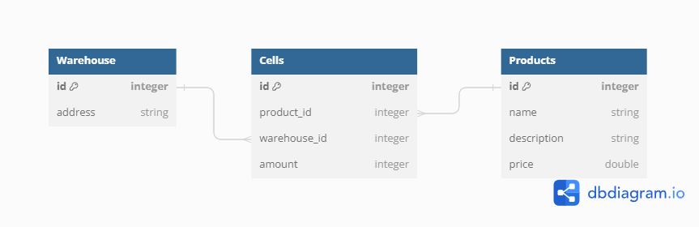

# SalesDepartmentApplication
Отчет по лабораторной работе лежит на гугл диске и доступен по [ссылке](https://docs.google.com/document/d/148B8xzKCPMoavOG2IbnitD14-2F-1hEXWI3ctW93apw/edit?usp=drivesdk)

Быстре перемещение по главам:
1. [Описание](#описание)  
2. [Быстрый запуск (docker)](#быстрый-запуск-docker)  
3. [Начало работы](#начало-работы)

## Описание
#### Лабораторная работа по введению в профессианальную деятельность, 1 курс, 8 вариант

Эта программа написана с целью автоматизации процессов в отделе продаж предприятия по производству мебели (название товаров, их описание, а так же цены были взяты с сайта [hoff](https://hoff.ru/))

Программа способна работать с базой данных sqlite  

<p style="text-align: center;">Схема базы данных. Тип связи - many-to-many</p>

Данные в базе задаются изначально и не меняются в процессе работы приложения. В качестве интерфейса для взаимодействия с пользователем выступает консоль. Данные выводятся в удобочитаемом формате с помощью таблиц.

В программе есть 4 основных команды:
>```Вывести католог товаров``` - выводит полный католог товаров, которые производятся на предприятии.

>```Товары на складе``` - по каждому складу выводится информация о находящихся на них товарах. Так же отдельно выводятся товары, которых нет в наличии ни на одном из складов.

>```Принять заказ``` - формируется случайный заказ (учитываются товары, которые есть в наличии, а так же доступное колличество) и выводится на экран. Имя заказчика не меняется, дата формирования заказа - текущее системное время.

>```Закрыть программу``` - Выводится предупреждение о закрытии программы, затем происходит закрытие программы. 


## Быстрый запуск (docker) ##
Найти информацию о том, как скачать docker для своей ОС можно [здесь](https://docs.docker.com/engine/install/)  

1. Клонируем образ  
```
docker pull artemilin15474/sales-department-application
```

2. Запускаем контейнер:  
```
docker run --rm -it artemilin15474/sales-department-application:latest
```


## Начало работы
0. Устанавливаем все необходимые инструменты, если они все ещё не установлены

### Ubuntu 22.04
```
sudo apt update && sudo apt upgrade -y 
sudo apt-get install sqlite3
sudo apt-get install dotnet-sdk-7.0
``` 
### Windows 
Откройте коммандную строку **от имени администратора**
```
winget install sqlite.sqlite
winget install Microsoft.DotNet.SDK.7
```

1. Клонируем репозиторий  
```
git clone https://github.com/artemilin-2023/SalesDepartmentApplication/
```
2. Перемещаемся в рабочую дирректорию  
```
cd ./SalesDepartmentApplication/SalesDepartmentApplication
```
3. Восстанавливаем базу данных из дампа  
```
sqlite3 data.db < database-dump.txt
```
4. Запускаем программу
```
dotnet build && dotnet run
```
